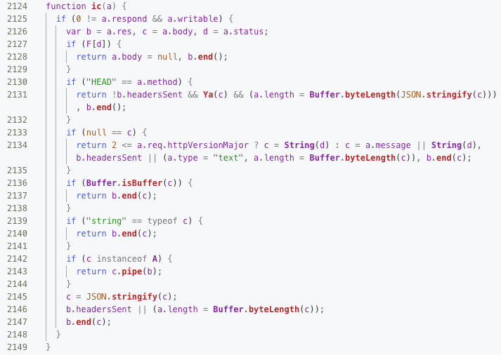

# @goa/koa

[](https://npmjs.org/package/@goa/koa)

`@goa/koa` is the [Koa web-sever](https://koajs.com) compiled and optimised with _Google Closure Compiler_ so that it has only 1 dependency (`mime-db`, for easy access to upgrades). The types are written as JSDoc and don't require installing typings. The aim of this project is to demonstrate how to modernise the old-school NPM package making, including starting to use import/export statements without _Babel_, restoring to pure _JSDoc_ without TypeScript, and compiling the code into the single executable using the compiler, and testing the code with [_Zoroaster_](https://contexttesting.com) testing framework which is twice as fast and weighs 500KB against 50MB compared with _Jest_ (as used in the original repository).

<table>
<tr><th colspan="2">@Goa/Koa Source Code Is ~2000 Lines Of Code</th></tr>
<tr><td colspan="2">

</td></tr>
<tr>
 <td align="center">
  <strong>Yarn Install</strong>
 </td>
 <td align="center">
  <strong>NPM Install</strong>
 </td>
</tr>
<tr>
 <td align="center">

```sh
yarn add @goa/koa
```
 </td>
 <td align="center">

```sh
npm install @goa/koa
```
 </td>
</tr>
</table>

## Table Of Contents

- [Table Of Contents](#table-of-contents)
- [API](#api)
- [`constructor(): Goa`](#constructor-goa)
- [Copyright](#copyright)

<p align="center"><a href="#table-of-contents"></a></p>

## API

The package is available by importing its default function:

```js
import Goa from '@goa/koa'
```

<p align="center"><a href="#table-of-contents"></a></p>

## `constructor(): Goa`

Creates a new app.

<table>
<tr><th><a href="example/index.js">Source</a></th><th>Output</th></tr>
<tr><td>

```js
import aqt from '@rqt/aqt'
import Goa from '@goa/koa'

const goa = new Goa()
goa.use(async (ctx, next) => {
  ctx.body = 'Hello World'
  ctx.status = 201
  ctx.message = 'example'
  await next()
})
goa.listen(3000, async function() {
  const url = `http://localhost:3000`
  console.log(url, '\n')
  const res = await aqt(url)
  console.log(res)
  this.close()
})
```
</td>
<td>

```js
http://localhost:3000 

{ body: 'Hello World',
  headers: 
   { 'content-type': 'text/plain; charset=utf-8',
     'content-length': '11',
     date: 'Fri, 26 Jul 2019 01:34:23 GMT',
     connection: 'close' },
  statusCode: 201,
  statusMessage: 'example' }
```
</td></tr>
</table>

<p align="center"><a href="#table-of-contents"></a></p>

## Copyright

The Koa web server by its [authors](https://github.com/koajs/koa).

---

<table>
  <tr>
    <th>
      <a href="https://artd.eco">
        
      </a>
    </th>
    <th>© <a href="https://artd.eco">Art Deco</a> for <a href="https://idio.cc">Idio</a> 2019</th>
    <th>
      <a href="https://idio.cc">
        
      </a>
    </th>
    <th>
      <a href="https://www.technation.sucks" title="Tech Nation Visa">
        
      </a>
    </th>
    <th><a href="https://www.technation.sucks">Tech Nation Visa Sucks</a></th>
  </tr>
</table>

<p align="center"><a href="#table-of-contents"></a></p>